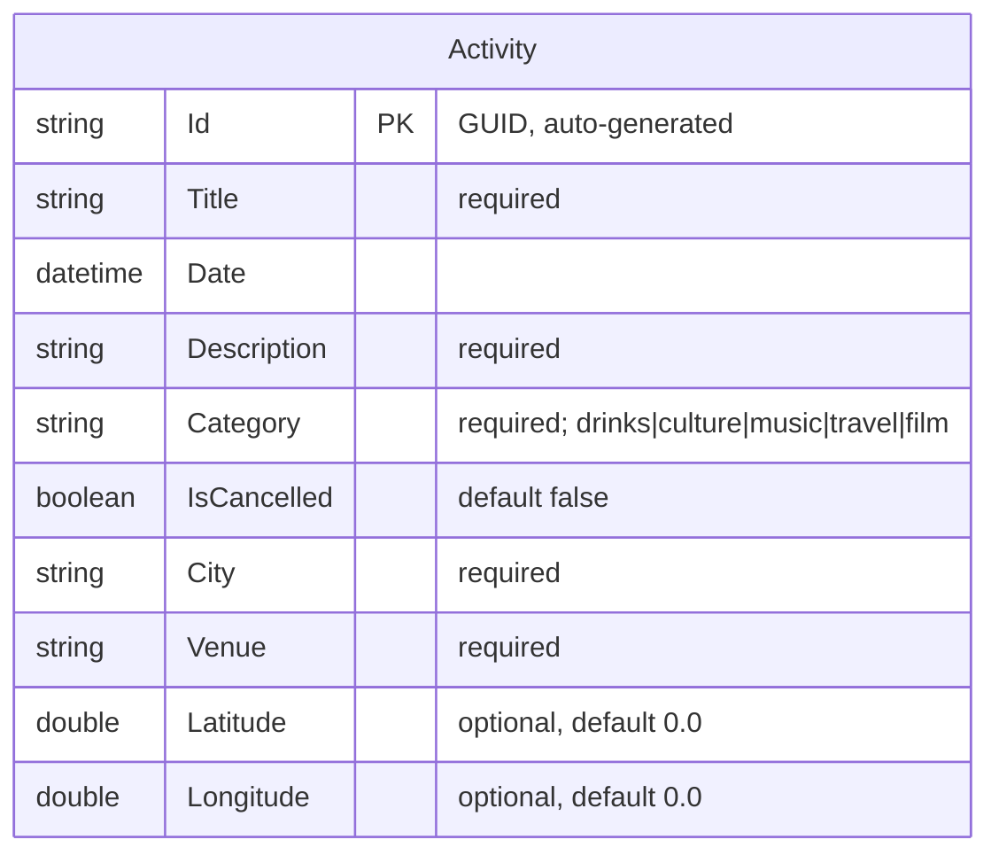

# Data Model Documentation

This document describes the data model for the Reactivities application — an activity management system. It covers the sole domain entity, its field definitions, the write DTO, the frontend type, and an ER diagram.

## Model Descriptions

### 1. Activity

Represents a social activity that users can browse, create, edit, and delete.

**C# Domain Entity** (`backend/Domain/Activity.cs`):

| Field | C# Type | Required | Default | Notes |
|---|---|---|---|---|
| `Id` | `string` | auto | `Guid.NewGuid().ToString()` | GUID primary key; never provided by the client on create |
| `Title` | `string` | yes (`required`) | — | Display name of the activity |
| `Date` | `DateTime` | yes | — | Date and time the activity takes place |
| `Description` | `string` | yes (`required`) | — | Full description of the activity |
| `Category` | `string` | yes (`required`) | — | Classification; known values: `drinks`, `culture`, `music`, `travel`, `film` |
| `IsCancelled` | `bool` | yes | `false` | Indicates whether the activity has been cancelled |
| `City` | `string` | yes (`required`) | — | City where the activity takes place |
| `Venue` | `string` | yes (`required`) | — | Specific venue or address |
| `Latitude` | `double` | no | `0.0` | Geographic latitude coordinate |
| `Longitude` | `double` | no | `0.0` | Geographic longitude coordinate |

**Validation Rules**:
- `Title`, `Description`, `Category`, `City`, `Venue` — required; no max length enforced at the database layer.
- `Category` — free text; the application uses the values `drinks`, `culture`, `music`, `travel`, `film` in seed data and UI filters.
- `Latitude` / `Longitude` — optional; default `0.0` when not provided.
- `Id` — auto-generated; excluded from `ActivityRequest` DTO to prevent client-supplied IDs.
- `IsCancelled` — excluded from `ActivityRequest` DTO; can only be set server-side (future feature).

---

### 2. ActivityRequest (Write DTO)

Used as the request body for POST (create). Defined in `backend/Application/Activities/Requests/ActivityRequest.cs`.

| Field | C# Type | Required | Notes |
|---|---|---|---|
| `Title` | `string` | yes (`[Required]`) | |
| `Date` | `DateTime` | no | Defaults to `DateTime.MinValue` if omitted |
| `Description` | `string` | yes (`[Required]`) | |
| `Category` | `string` | yes (`[Required]`) | |
| `City` | `string` | yes (`[Required]`) | |
| `Venue` | `string` | yes (`[Required]`) | |
| `Latitude` | `double` | no | |
| `Longitude` | `double` | no | |

`Id` and `IsCancelled` are deliberately omitted — these fields must not be set by the client on create.

---

### 3. Frontend Type

Ambient TypeScript type in `client/src/lib/types/index.d.ts`. Matches the JSON shape returned by the API (camelCase, `date` as ISO 8601 string):

| Field | TypeScript Type | Notes |
|---|---|---|
| `id` | `string` | GUID |
| `title` | `string` | |
| `date` | `string` | ISO 8601 — not a `Date` object |
| `description` | `string` | |
| `category` | `string` | |
| `isCancelled` | `boolean` | |
| `city` | `string` | |
| `venue` | `string` | |
| `latitude` | `number` | |
| `longitude` | `number` | |

---

## Entity-Relationship Diagram

The application currently has a single entity with no relationships:

---

## Seed Data

`backend/Persistence/DbInitializer.cs` seeds 9 activities on first startup (when the `Activities` table is empty). Seed data covers:

- **Date range**: approximately 2 months before to 8 months after the current date (relative to startup time)
- **Cities**: London, Paris
- **Categories**: `drinks`, `culture`, `music`, `travel`, `film`
- **Coordinates**: realistic latitude/longitude values for London and Paris locations

The seed is idempotent — it only runs when the table is empty. Deleting `reactivities.db` and restarting the API will re-seed.

---

## Key Design Principles

- **Single entity, simple schema**: The domain is intentionally minimal — one table, no joins, no foreign keys.
- **GUID primary keys**: Generated in C# (`Guid.NewGuid().ToString()`), not by the database. This avoids identity column complications with SQLite and makes IDs predictable for testing.
- **No DB-level constraints on string length**: Validation is handled at the DTO level (`[Required]` attributes) and by the ASP.NET Core model binding pipeline.
- **IsCancelled server-side only**: The field is excluded from the write DTO to prevent accidental or malicious cancellation via the create endpoint.
